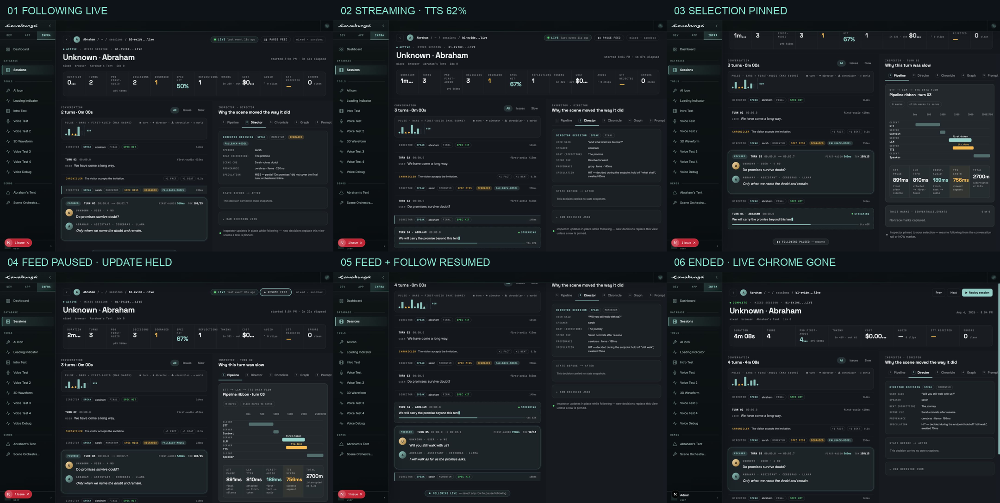
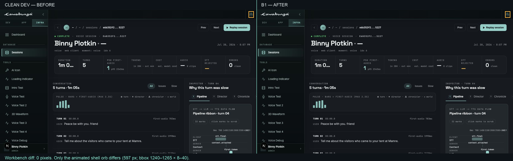

# B1 workbench live-mode QA

Evidence for PR #126, captured from `codex/workbench-live-mode-b1` at commit
`9d5a1bf` with the Ocean theme enabled.

## Live interaction sequence

1. **Following live** — the LIVE cluster, ticking elapsed values, live journal
   KPIs, NOW edge, follow pill, and newest Director decision are visible.
2. **Streaming** — a same-session feed update adds the dashed streaming card,
   live cursor, STREAMING marker, and 62% TTS progress.
3. **Pinned** — selecting an earlier turn changes the UI reducer to FOLLOWING
   PAUSED and pins Pipeline while PAUSE FEED remains available.
4. **Feed paused** — PAUSE FEED changes to RESUME FEED. A new turn was posted
   and remained absent after a full poll interval, while the pinned selection
   stayed unchanged.
5. **Resumed** — RESUME FEED catches up the queued turn. Clicking NOW restores
   FOLLOWING LIVE and the Director inspector advances to the newest decision.
6. **Ended** — the streaming row was first replaced in place by its completed
   form. Ending the session then removed LIVE, pause/resume, follow, live KPIs,
   ticking elapsed, and NOW chrome, restoring the Replay header.

Individual full-size captures:

- [Following live](./b1-live-01-following.jpg)
- [Streaming turn](./b1-live-02-streaming.jpg)
- [Pinned selection](./b1-live-03-pinned.jpg)
- [Network feed paused](./b1-live-04-feed-paused.jpg)
- [Feed and following resumed](./b1-live-05-resumed.jpg)
- [Settled ended mode](./b1-live-06-ended.jpg)

## Ended-session regression

The same persisted ended session (`e6b352f2-7e4f-4218-ba8a-c0ff67795227`)
was captured in the same browser runtime at 1280×720 from clean `dev`
(`4d1203e`) and B1.

- Workbench diff: **0 pixels**.
- Full screenshot diff: 597 of 921,600 pixels (0.065%), all inside the
  animated shell mesh orb at bounding box x=1240–1265, y=8–40.
- Masking that 26×33 animated shell region yields an exact zero-pixel diff.

Source captures:

- [Clean dev — before](./b1-ended-before-dev.jpg)
- [B1 — after](./b1-ended-after-b1.jpg)
