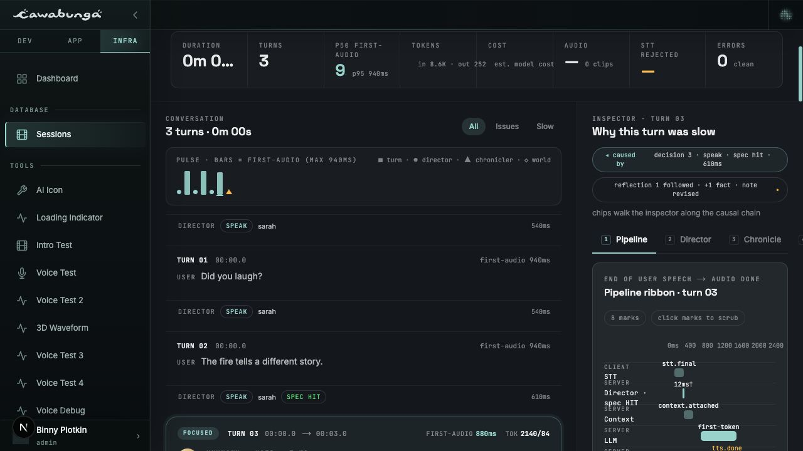
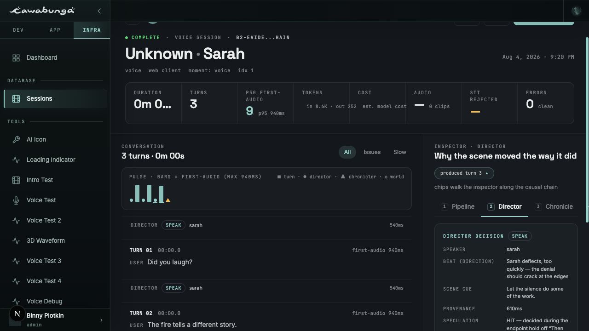
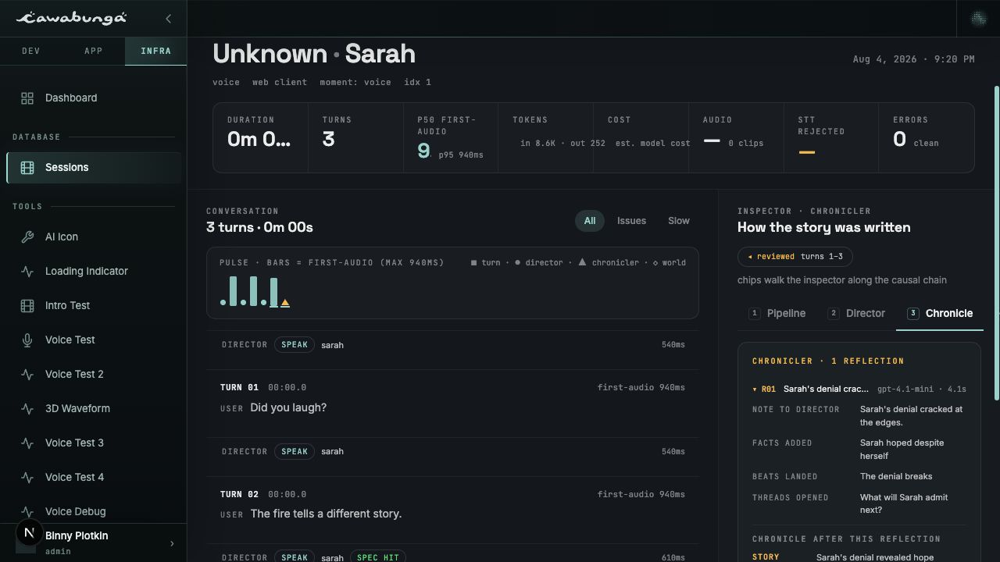
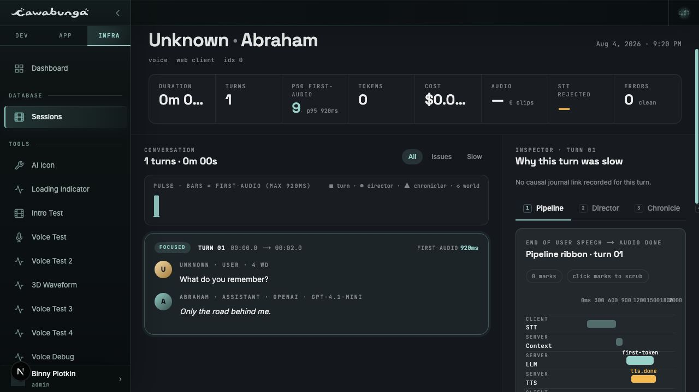

# B2 turn analysis and causality QA

Captured against the B2 branch at 1280 × 720 using two local-only session
records: a three-turn journaled chain and a single-turn pre-journal session.

## Causal-chain interaction

1. Select turn 3. The inspector anchors on **Pipeline** and shows both the
   causing decision and following reflection chips.
2. Click **caused by decision 3**. The inspector anchors on **Director** and
   shows **produced turn 3**.
3. Click **produced turn 3**, then **reflection 1 followed**. The inspector
   anchors on **Chronicle** and shows **reviewed turns 1–3**.
4. Click **reviewed turns 1–3**. The inspector returns to turn 3 on
   **Pipeline**.

Verified in the browser with semantic assertions for every tab transition,
the speculation-hit Director sliver (`12ms†` vs `610ms` full latency), the
four curator page chips, and the Pipeline context/guard fields.

## Pre-journal regression

The older-session path renders the normal turn inspector without inventing
director or chronicler links. It states: **No causal journal link recorded for
this turn.** Missing speaker context, output audio, and guard evidence use
explicit “not captured” / “not retained” copy.

